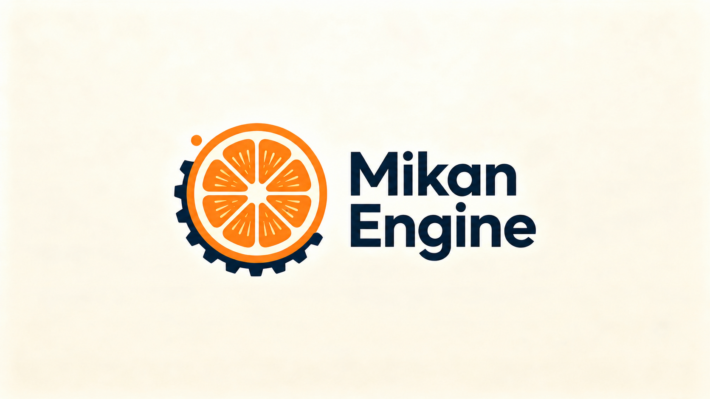

# MikanEngine

<p align="center">
  
</p>

使用 C++20、Vulkan 和 SDL3 构建的自研 2D/3D 游戏引擎，包含运行时、ImGui 编辑器、ECS 场景系统、物理、脚本插件、资源序列化和测试工具。

## 技术栈

| 类别 | 技术 |
|---|---|
| 语言与构建 | C++20、CMake、Ninja、MSVC |
| 图形与窗口 | Vulkan、SDL3、GLSL/SPIR-V |
| 编辑器与 UI | Dear ImGui |
| 场景与资源 | ECS、JSON、Assimp、glTF、Prefab |
| 物理 | Jolt Physics、Box2D |
| 其他 | msdfgen、RenderDoc/Nsight 调试工作流 |
| 平台 | Windows；包含 Android arm64 构建支持 |

## 架构

```text
MikanEngine.exe                桌面宿主：SDL/Vulkan 初始化、主循环和渲染运行
├── Game.dll                   运行时核心：Rendering / ECS / Scene / Physics / Audio
├── Editor.dll                 可选编辑器：ImGui 场景编辑、资产浏览、预览和调试
└── Game<name>.dll             游戏插件：具体玩法、脚本和项目逻辑，支持热重载

MikanTestRunner.exe            玩法测试宿主：不创建窗口，不初始化 SDL Video/Vulkan
└── Game.dll → GameplayRuntime 固定步长推进 ECS、物理、脚本和场景
```

引擎运行时、编辑器和游戏玩法分别组织。游戏插件通过 `Game.lib` 使用引擎公开接口，玩法代码可以独立编译和重新加载；编辑器作为可选动态模块加载。`MikanTestRunner.exe` 复用 `Game.dll` 的 GameplayRuntime，在没有窗口和 Vulkan 上下文的情况下运行玩法测试。

## 项目与资源

桌面端采用项目驱动的启动方式：项目管理器只负责选择项目，运行时不会自动把引擎目录或根目录 `assets/` 当作默认项目。可以在启动页导入已有的 `project.json`，也可以填写父目录和项目名称新建项目；独立运行、测试和插件编译都应显式传入 `--project` 或 `-ProjectPath`。

一个项目的基本布局如下：

```text
projects/<project-name>/
├── project.json          项目清单、默认场景、玩法模块和资源白名单
├── scenes/               场景文件
├── assets/               可选的项目资源子目录
├── models/、textures/    其他项目资源目录
└── games/                项目玩法源码（位于具体项目目录内）
```

`project.json` 的 `resourceRoot` 决定项目资源根，`codeRoot` 决定玩法源码根（通常为项目内的 `games`）。场景中的相对资源路径相对于 `resourceRoot` 解析；`engine/...` 专用于引擎自带资源。玩法插件只从当前项目的 `codeRoot` 编译，仓库根目录不再提供全局 `games/` 编译入口。Android 仍使用 APK 的 `assets/` 打包边界；桌面端不会隐式读取仓库根目录的 `assets/`。仓库根目录的 `assets/` 不属于项目或发布内容，旧测试资料保留在开发机即可。

## 功能

### 渲染

- Vulkan 2D/3D 渲染，支持模型、材质、天空、阴影、体素世界和 2D 图元。
- glTF 骨骼动画、GPU skinning 和 CPU skinning 回退路径。
- TAA、GTAO、SSGI、Bloom、SMAA、CMAA2、Tonemap 等可配置后处理路径。
- Hi-Z 深度纹理、BVH/四叉树遮挡剔除和 GPU 间接绘制相关路径。
- GLSL/SPIR-V Shader 热重载，便于着色器迭代和调试。

渲染流程大致为：

```text
VulkanManager
    └── SceneRenderer
        └── SceneCollector
            └── Model / Voxel / Shadow / Sky / 2D Renderers
                └── PostProcessChain
                    └── Game View / Scene View / Swapchain
```

### 运行时与场景

- ECS 实体、组件注册和系统更新。
- 场景层级、Transform、Prefab、JSON 场景序列化和项目资源管理。
- C++ 脚本组件、游戏插件、脚本热重载和运行时状态导出。
- 模型、纹理、材质、动画、音频和场景资源加载。

### 编辑器

- ImGui 场景视图和运行时调试。
- 资产浏览、模型/纹理预览和材质编辑。
- 场景实体、组件、Transform 和资源引用编辑。

### 物理与测试

- Jolt Physics 3D 物理和 Box2D 2D 物理。
- CPU-only 玩法测试路径，不初始化 SDL Video 和 Vulkan。
- Vulkan headless 渲染测试路径，用于交换链、渲染管线和资源集成验证。
- 场景 JSON 离线校验、固定步长运行、状态 JSON 导出和自动化测试结果记录。

## 构建

### 环境要求

- Windows
- Visual Studio/MSVC x64 工具链
- CMake 3.21 或更高版本
- Ninja
- Vulkan SDK
- PowerShell

建议使用仓库提供的构建脚本。桌面端根 CMake、Android 原生 CMake 和 Windows 游戏插件编译脚本均使用 C++20；脚本会探测 Visual Studio 环境、检查引擎进程占用并将日志写入 `out/build/build.log`。

在项目根目录执行：

```powershell
# 默认构建 MikanEngine（连带 Game、Editor 和 Shader）
powershell -NoProfile -ExecutionPolicy Bypass -File ./tools/build.ps1 -ConfigureIfMissing

# 按目标构建
powershell -NoProfile -ExecutionPolicy Bypass -File ./tools/build.ps1 -Target Game
powershell -NoProfile -ExecutionPolicy Bypass -File ./tools/build.ps1 -Target Editor
powershell -NoProfile -ExecutionPolicy Bypass -File ./tools/build.ps1 -Target MikanTestRunner
powershell -NoProfile -ExecutionPolicy Bypass -File ./tools/build.ps1 -Target CompileShaders
```

也可以在 Visual Studio Developer PowerShell 中使用 CMake Preset：

```powershell
cmake --preset x64-release
cmake --build --preset x64-release --target MikanEngine
```

Windows 构建中，Jolt、msdfgen 和 Box2D 作为独立的 `STATIC` 目标管理，再由 `Game` 链接。构建输出位于 `out/build/x64-Release/`。

### Android arm64

Android 工程位于 `android/`，将引擎运行时编译为 `mikanengine.so` 并打包为 `arm64-v8a` APK。需要 Android SDK、NDK、CMake 3.22.1 和与 Android Gradle Plugin 兼容的 JDK；Gradle wrapper 会从官方发行地址获取 Gradle。

首次构建前，将引擎资源和指定项目资源同步到 APK 的临时 `assets/` 目录，然后执行 Gradle 构建。默认同步项目为 `projects/third-person-navigation`，也可以通过 `-ProjectPath` 指定其他项目：

```powershell
cd android
powershell -NoProfile -ExecutionPolicy Bypass -File .\sync_assets.ps1 -ProjectPath ..\projects\third-person-navigation
.\gradlew.bat :app:assembleDebug --console=plain
```

`android/app/src/main/assets/` 是同步生成目录，不应提交。Android 端使用的 SDL AAR 和 arm64 Assimp 运行库位于 `android/app/libs/`；其中较大的 Assimp 二进制由 Git LFS 管理，克隆仓库前请安装并启用 Git LFS。

## 运行与测试

```powershell
# 启动项目管理器：不会自动选择 Default Project
.\out\build\x64-Release\MikanEngine.exe

# 显式打开一个项目（发布/编辑器模式）
.\out\build\x64-Release\MikanEngine.exe --project .\projects\third-person-navigation

# 关闭编辑器模式，直接运行项目
.\out\build\x64-Release\MikanEngine.exe --project .\projects\third-person-navigation --no-editor

# 固定帧 headless 运行，--scene 可省略并使用 project.json.scene
.\out\build\x64-Release\MikanEngine.exe --project .\projects\third-person-navigation --headless --frames 60 --no-voxel-world

# 为指定项目独立编译玩法插件
powershell -NoProfile -ExecutionPolicy Bypass -File .\tools\compile_games.ps1 -ProjectPath .\projects\third-person-navigation
powershell -NoProfile -ExecutionPolicy Bypass -File .\tools\compile_games.ps1 -ProjectPath .\projects\engine-samples

# 运行统一测试入口
powershell -NoProfile -ExecutionPolicy Bypass -File .\tools\test.ps1 -Layer gameplay
powershell -NoProfile -ExecutionPolicy Bypass -File .\tools\test.ps1 -Layer render

# 离线校验项目场景 JSON
powershell -NoProfile -ExecutionPolicy Bypass -File .\tools\validate_scene.ps1 .\projects\engine-samples\scenes\contact2d.json -ProjectPath .\projects\engine-samples -CheckAssets
```

`tools/test.ps1` 支持 `validate`、`gameplay`、`render` 和 `all` 测试层，也支持通过 `-Case` 选择测试场景。玩法层使用 `MikanTestRunner.exe`，渲染层使用 `MikanEngine.exe --headless`；每个测试用例都会显式绑定项目路径，并按项目编译对应插件。

完整构建、运行和测试参数以 `tools/` 下的脚本帮助和参数定义为准。

## 示例场景

| 文件 | 内容 |
|---|---|
| [`projects/third-person-navigation/scenes/main.json`](projects/third-person-navigation/scenes/main.json) | 项目化第三人称场景、材质和玩法源码 |
| [`projects/third-person-navigation/scenes/terrain.json`](projects/third-person-navigation/scenes/terrain.json) | 同一第三人称项目中的地形场景 |
| [`projects/engine-samples/scenes/contact2d.json`](projects/engine-samples/scenes/contact2d.json) | 项目内的 Box2D 接触和 2D 物理示例 |

## 目录结构

| 目录 | 内容 |
|---|---|
| `src/`、`include/` | 引擎实现和公开头文件 |
| `projects/*/games/` | 各项目自己的玩法插件源码 |
| `projects/` | 自包含项目及其场景、资源和玩法源码 |
| `engine/` | 引擎系统资源，如 Shader、字体和内置纹理 |
| `tools/` | 构建、测试、场景处理工具及内置工具包 |
| `tools/ktx/` | KTX-Software 运行组件和 KTX2 转换工具 |
| `dependencies/` | Vulkan、SDL3、ImGui、Jolt、Box2D 等第三方依赖 |

## 文档与入口

- 构建配置：[`CMakePresets.json`](CMakePresets.json)
- 构建脚本：[`tools/build.ps1`](tools/build.ps1)
- 测试脚本：[`tools/test.ps1`](tools/test.ps1)
- 场景校验：[`tools/validate_scene.ps1`](tools/validate_scene.ps1)

## 许可证

MikanEngine 自身代码使用 [MIT License](LICENSE)。第三方依赖和项目资源仍以各自附带的许可证、版权声明和来源说明为准。
